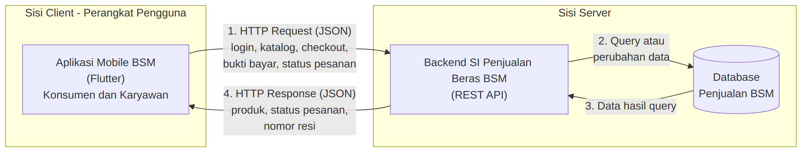
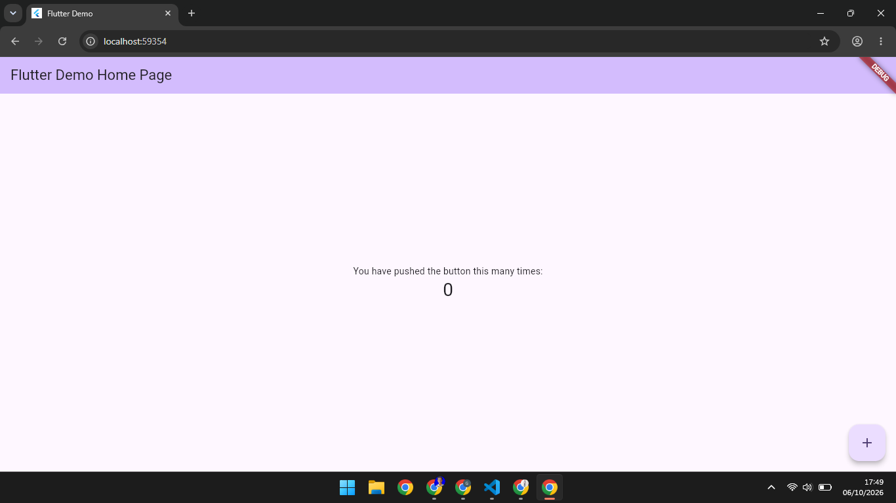
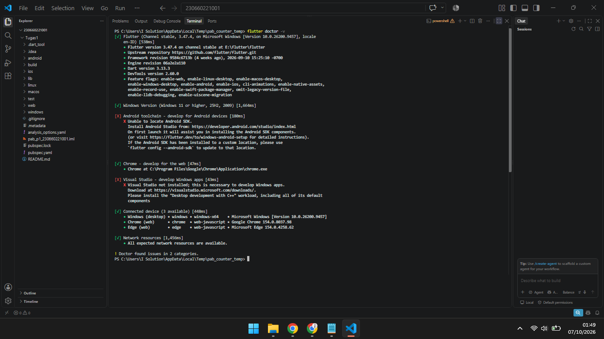
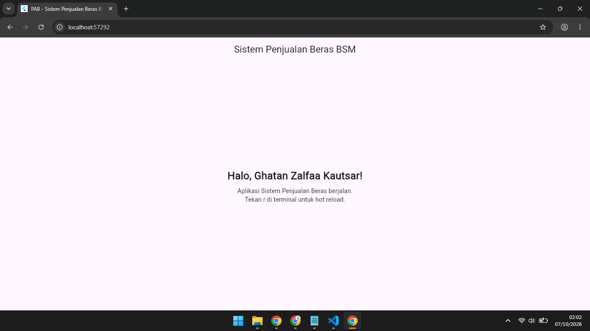

# Tugas 1 — Identifikasi Kebutuhan Aplikasi Bergerak

## Identitas

- **Nama:** Ghatan Zalfaa Kautsar
- **NIM:** 230660221001
- **Mata Kuliah:** Pemrograman Aplikasi Bergerak (PAB)
- **Pertemuan:** 1
- **Domain:** Sistem Penjualan Beras di Pabrik BSM

## 1. Deskripsi Sistem

Pengguna aplikasi ini adalah konsumen yang memesan beras dan karyawan Pabrik BSM yang menyiapkan serta mengirim pesanan, sedangkan admin dan owner tetap dilayani oleh backend SI. Saat ini pemesanan dilakukan secara manual lewat telepon/WhatsApp atau datang langsung, pesanan dicatat di buku, dan bukti transfer dikirim lewat WhatsApp lalu dicocokkan manual dengan mutasi rekening, sehingga status pembayaran dan pengiriman sulit dipantau, informasi tersebar dan rawan hilang atau salah, serta karyawan kesulitan mengetahui pesanan yang siap dikirim. Solusi berbentuk aplikasi mobile dipilih karena karakteristik **konteks bergerak**, yaitu konsumen memesan dan membayar dari lokasi mana pun sementara karyawan berpindah antara gudang dan tempat pengantaran, sehingga proses pesan, bayar, dan kirim perlu dilakukan dari perangkat yang selalu dibawa. Alasan lain adalah **sesi penggunaan singkat**, karena memeriksa status pesanan, mengunggah bukti transfer, atau memasukkan nomor resi hanya memakan waktu beberapa menit sehingga alurnya harus selesai dalam beberapa langkah, serta **interaksi sentuh** saat memilih produk dan mengatur jumlah di keranjang.

## 2. Diagram Arsitektur

File sumber diagram: [`diagram.mmd`](diagram.mmd) (Mermaid).

Alur komunikasi pada diagram:

1. **Aplikasi Mobile (Flutter) → HTTP Request (JSON) → Backend SI (REST API).** Contohnya login, meminta katalog, checkout, mengirim konfirmasi pembayaran beserta bukti transfer, dan memperbarui status pengiriman.
2. **Backend SI → Database.** Backend menjalankan query atau perubahan data.
3. **Database → Backend SI.** Database mengembalikan data hasil query.
4. **Backend SI → HTTP Response (JSON) → Aplikasi Mobile.** Aplikasi menampilkan data produk, status pesanan, dan nomor resi.

Aplikasi mobile tidak mengakses database secara langsung; seluruh akses data melalui Backend SI. Diagram ini adalah rancangan arsitektur target. Pada Tugas 1 tidak ada backend atau API yang dibangun maupun diuji, dan integrasi REST API direncanakan pada Minggu 9–10.

## 3. Tabel Kebutuhan

| No. | Permintaan | Pengguna | Karakteristik Mobile yang Terkait | Fitur Aplikasi | Materi Pemenuh |
|:---:|:-----------|:---------|:----------------------------------|:---------------|:---------------|
| 1 | Melihat daftar beras beserta harga dan informasi produk | Konsumen | **Layar kecil dan variatif**: daftar produk harus tertata adaptif di berbagai ukuran layar. **Interaksi sentuh**: item produk mudah diketuk. | Halaman katalog berupa daftar kartu produk (nama dan harga per kg) dan halaman detail produk | Minggu 3 (struktur Flutter dan widget), Minggu 5 (UI/UX), Minggu 9–10 (data produk dari REST API) |
| 2 | Memilih produk dan jumlah, mengelola keranjang, lalu checkout dengan alamat dan metode pengiriman serta melihat subtotal, ongkos kirim, dan total | Konsumen | **Interaksi sentuh**: tombol tambah/kurang jumlah dengan target sentuh cukup besar, hindari input panjang. **Sesi penggunaan singkat**: alur dari memilih produk sampai checkout selesai dalam beberapa langkah. | Keranjang belanja (tambah, ubah jumlah, hapus item), form checkout (alamat dan pilihan metode pengiriman), dan ringkasan pesanan yang menampilkan hasil hitung dari backend | Minggu 3 (widget), Minggu 6 (navigasi dan form), Minggu 9–10 (REST API untuk ongkir, total, dan penyimpanan pesanan) |
| 3 | Mengonfirmasi pembayaran dengan mengunggah bukti transfer | Konsumen | **Konteks bergerak**: bukti transfer dapat difoto atau dipilih langsung dari ponsel. **Daya dan data terbatas**: ukuran gambar dibatasi sebelum diunggah agar hemat kuota. | Form konfirmasi pembayaran (tanggal transfer, jumlah, bank, foto bukti transfer dari kamera atau galeri) dan tombol kirim | Minggu 6 (form dan validasi), Minggu 9–10 (kirim data ke REST API), Minggu 11 (kamera/file, perlu perangkat fisik atau emulator) |
| 4 | Memantau status pesanan, riwayat pembelian, dan nomor resi | Konsumen | **Sesi penggunaan singkat**: status dicek dalam hitungan detik. **Konektivitas terbatas**: jaringan dapat lambat atau hilang, sehingga perlu data terakhir dan pesan error yang jelas. | Halaman riwayat pesanan dan detail status (contoh: Menunggu Pembayaran, Menunggu Verifikasi, Terverifikasi, Sedang Dikirim) beserta nomor resi; pelacakan kurir dilakukan di luar aplikasi | Minggu 7 (data lokal), Minggu 9–10 (REST API) |
| 5 | Menerima pemberitahuan saat status pesanan berubah | Konsumen | **Konteks bergerak**: pengguna tidak membuka aplikasi terus-menerus. **Daya dan data terbatas**: informasi disampaikan saat ada perubahan, bukan dengan memeriksa berulang kali. | Notifikasi perubahan status (contoh: pembayaran terverifikasi, pesanan dikirim dengan nomor resi) | Minggu 11 (notifikasi, perlu perangkat fisik atau emulator) |
| 6 | Melihat pesanan siap kirim, memasukkan nomor resi, dan memperbarui status pengiriman | Karyawan | **Konteks bergerak**: karyawan berpindah antara gudang dan tempat serah-terima ke kurir. **Interaksi sentuh**: input singkat dengan tombol dan form sederhana. | Daftar pesanan berstatus Siap Dikirim, detail pesanan dan alamat, form nomor resi, serta tombol memperbarui status | Minggu 6 (navigasi dan form), Minggu 9–10 (REST API) |
| 7 | Login dan hanya mengakses fitur sesuai peran | Konsumen dan Karyawan | **Interaksi sentuh**: form login ringkas. **Sesi penggunaan singkat**: sesi tersimpan sehingga pengguna tidak login ulang setiap membuka aplikasi. | Form login, navigasi ke beranda sesuai peran, dan penyimpanan sesi secara aman; pengecekan kredensial dan hak akses tetap dilakukan backend | Minggu 6 (form dan navigasi), Minggu 9–10 (REST API autentikasi), Minggu 12 (secure storage) |
| 8 | Memverifikasi pembayaran (menyetujui atau menolak) dengan mencocokkan bukti transfer dan mutasi rekening | Admin | Tidak berlaku (pekerjaan backend, bukan aplikasi mobile) | **Di luar lingkup (backend SI)**. Aplikasi mobile hanya menampilkan hasilnya sebagai status pesanan pada baris 4 dan 5. | Tidak ada (pekerjaan backend SI) |
| 9 | Mengelola data master produk, mengarsipkan transaksi lama, dan menyusun laporan penjualan | Admin dan Owner | Tidak berlaku (pekerjaan backend, bukan aplikasi mobile) | **Di luar lingkup (backend SI)**. Pengelolaan data oleh petugas dan pengolahan laporan dikerjakan di sisi backend. | Tidak ada (pekerjaan backend SI) |

Seluruh fitur pada kolom Fitur Aplikasi masih berstatus rencana; belum ada yang diimplementasikan pada Tugas 1.

**Sumber dan adaptasi.**

- Setiap baris berasal dari butir pada subbab Kebutuhan Sistem di Laporan BSM: baris 1–2 dari butir 1 dan 2, baris 3 dari butir 3, baris 4 dari butir 6 dan 7, baris 5 dari butir 7, baris 6 dari butir 6, baris 7 dari butir 10, baris 8 dari butir 4, dan baris 9 dari butir 5, 8, dan 9.
- Batasan dari laporan tetap berlaku: pembayaran lewat transfer bank manual tanpa payment gateway, ongkir sederhana, dan tanpa integrasi pelacakan kurir.
- Adaptasi ke konteks mobile (bukan fakta dari laporan): laporan menggambarkan sistem berbasis web, sehingga bagian client diadaptasi menjadi aplikasi mobile Flutter.
- Adaptasi lain: pembagian lingkup (konsumen dan karyawan di aplikasi mobile, admin dan owner di backend SI), bentuk notifikasi perangkat (laporan hanya menyebut status yang terlihat saat login), penghitungan total dan ongkir oleh backend, penyimpanan sesi secara aman, pembatasan ukuran gambar, serta pemetaan karakteristik mobile pada setiap baris.

## 4. Bukti Environment

**`flutter doctor -v` sebelum perbaikan:**

**`flutter doctor -v` sesudah perbaikan:**

**Aplikasi counter bawaan Flutter yang sedang berjalan:**

## 5. Refleksi

Fitur perangkat yang paling relevan untuk aplikasi penjualan beras Pabrik BSM adalah kamera. Laporan BSM menyebutkan bahwa konsumen mengunggah foto bukti transfer untuk diverifikasi admin, sehingga kamera memungkinkan bukti pembayaran diambil dan dikirim langsung dari ponsel ke sistem, bukan lewat WhatsApp seperti sekarang. Pilihan ini sejalan dengan karakteristik konteks bergerak pada materi, karena kamera relevan bagi proses bisnis ketika pengguna berpindah tempat, dan penerapannya direncanakan pada Minggu 11 dengan perangkat fisik atau emulator karena plugin fitur perangkat tidak berfungsi pada target web.

## Catatan Sumber dan Penggunaan AI

- Sumber: materi Pertemuan 1 PAB beserta panduan pengerjaan Tugas 1 (repository dosen), dan laporan "Sistem Penjualan Beras di Pabrik BSM" (Analisis Perancangan Sistem Berorientasi Objek, Kelompok 6).
- Penyusunan draf README dan file sumber diagram dibantu oleh Claude (asisten AI) berdasarkan dua sumber di atas.