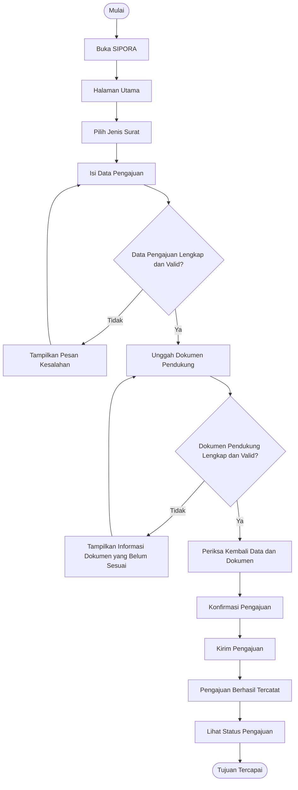

# Dokumen Kebutuhan SIPORA

## 1. Deskripsi Aplikasi

**SIPORA (Sistem Informasi Pengajuan Surat Observasi dan Riset Akademik)** merupakan aplikasi mobile yang dirancang untuk membantu mahasiswa dalam mengajukan surat observasi dan surat riset akademik kepada pihak fakultas. Aplikasi ini berangkat dari kebutuhan akan proses pengajuan yang lebih terstruktur, terutama dalam pengisian data, penyampaian dokumen pendukung, serta pemantauan status pengajuan. Melalui SIPORA, mahasiswa dapat memilih jenis surat, mengisi data pengajuan, melengkapi dokumen pendukung, mengirim pengajuan, dan memantau perkembangan prosesnya hingga surat selesai. Bagi petugas fakultas, SIPORA membantu menyediakan informasi pengajuan yang lebih terorganisasi sehingga proses pemeriksaan data, pemeriksaan dokumen, dan pembaruan status dapat dilakukan secara lebih sistematis. Penggunaan platform mobile dipilih karena proses pengajuan dapat dilakukan melalui perangkat yang umum digunakan mahasiswa maupun petugas tanpa bergantung pada tempat tertentu selama tersedia akses internet.

---

## 2. User Persona

### Persona 1 — Intan — Mahasiswa

| Komponen                  | Deskripsi                                                                                                                                                                                        |
| ------------------------- | ------------------------------------------------------------------------------------------------------------------------------------------------------------------------------------------------ |
| **Nama dan peran**        | Intan, mahasiswa yang membutuhkan surat observasi atau riset akademik sebagai bagian dari kegiatan akademik.                                                                                     |
| **Tujuan**                | Mengajukan surat yang dibutuhkan secara lengkap serta memperoleh informasi yang jelas mengenai perkembangan pengajuan sampai surat selesai.                                                      |
| **Kendala**               | Perlu memastikan data pengajuan sesuai dengan kebutuhan kegiatan, menyiapkan dokumen pendukung, dan mengetahui status pengajuan tanpa harus melakukan pengecekan secara berulang kepada petugas. |
| **Perangkat dan konteks** | Smartphone, digunakan ketika berada di lingkungan kampus, tempat tinggal, atau lokasi kegiatan akademik dengan akses internet.                                                                   |
| **Frekuensi penggunaan**  | Digunakan sesuai kebutuhan kegiatan observasi atau riset akademik, terutama ketika mahasiswa perlu mengajukan surat kepada pihak fakultas.                                                       |

### Persona 2 — Rina — Petugas Fakultas

| Komponen                  | Deskripsi                                                                                                                                                    |
| ------------------------- | ------------------------------------------------------------------------------------------------------------------------------------------------------------ |
| **Nama dan peran**        | Rina, petugas fakultas yang bertanggung jawab memeriksa dan memproses pengajuan surat dari mahasiswa.                                                        |
| **Tujuan**                | Memastikan data dan dokumen pengajuan telah sesuai serta memperbarui status pengajuan agar proses dapat diketahui oleh mahasiswa.                            |
| **Kendala**               | Perlu menangani beberapa pengajuan mahasiswa dengan kondisi yang berbeda sehingga informasi setiap pengajuan harus tersaji secara jelas dan mudah diperiksa. |
| **Perangkat dan konteks** | Smartphone atau perangkat kerja, digunakan di lingkungan fakultas untuk memeriksa dan memproses pengajuan mahasiswa.                                         |
| **Frekuensi penggunaan**  | Digunakan secara rutin selama terdapat pengajuan surat yang perlu diperiksa dan diproses.                                                                    |

---

## 3. Kebutuhan Fungsional

Kebutuhan fungsional SIPORA dirumuskan berdasarkan aktivitas utama yang diperlukan oleh mahasiswa dan petugas fakultas. Setiap kebutuhan ditulis sebagai satu fungsi yang dapat diamati dan diverifikasi.

| ID       | Rumusan Kebutuhan                                                                                                                                 | Terkait Persona |
| -------- | ------------------------------------------------------------------------------------------------------------------------------------------------- | --------------- |
| **F-01** | Mahasiswa dapat memilih jenis surat yang akan diajukan sehingga jenis pengajuan sesuai dengan kebutuhan kegiatan akademiknya.                     | Persona 1       |
| **F-02** | Mahasiswa dapat mengisi data pengajuan surat sehingga informasi yang diperlukan tercatat dalam pengajuan.                                         | Persona 1       |
| **F-03** | Mahasiswa dapat mengunggah dokumen pendukung sehingga persyaratan pengajuan dapat disampaikan kepada petugas fakultas.                            | Persona 1       |
| **F-04** | Mahasiswa dapat mengirim pengajuan setelah data dan dokumen pendukung dinyatakan lengkap sehingga pengajuan tercatat untuk diproses oleh petugas. | Persona 1       |
| **F-05** | Mahasiswa dapat melihat status pengajuan sehingga perkembangan proses pengajuan dapat diketahui.                                                  | Persona 1       |
| **F-06** | Mahasiswa dapat memperoleh surat yang telah selesai sehingga dokumen dapat digunakan untuk keperluan kegiatan akademik.                           | Persona 1       |
| **F-07** | Petugas fakultas dapat melihat daftar pengajuan mahasiswa sehingga pengajuan yang masuk dapat diidentifikasi untuk diproses.                      | Persona 2       |
| **F-08** | Petugas fakultas dapat memeriksa data pengajuan sehingga kesesuaian informasi yang diberikan mahasiswa dapat diketahui.                           | Persona 2       |
| **F-09** | Petugas fakultas dapat memeriksa dokumen pendukung sehingga kelengkapan persyaratan pengajuan dapat diketahui.                                    | Persona 2       |
| **F-10** | Petugas fakultas dapat memperbarui status pengajuan sehingga mahasiswa memperoleh informasi mengenai perkembangan proses pengajuan.               | Persona 2       |
| **F-11** | Petugas fakultas dapat mengunggah surat yang telah selesai sehingga mahasiswa dapat memperoleh dokumen surat dalam bentuk soft file.              | Persona 2       |

---

## 4. Kebutuhan Nonfungsional

Kebutuhan nonfungsional digunakan untuk menetapkan karakteristik kualitas yang perlu dipenuhi SIPORA agar dapat digunakan secara efektif dan nyaman oleh pengguna.

| ID        | Kategori      | Rumusan                                                                                                       | Kriteria Terukur                                                                                                                                    |
| --------- | ------------- | ------------------------------------------------------------------------------------------------------------- | --------------------------------------------------------------------------------------------------------------------------------------------------- |
| **NF-01** | Usability     | SIPORA harus menyediakan navigasi yang sederhana dan mudah dipahami oleh pengguna.                            | Pengguna dapat mencapai halaman utama pengajuan dalam **maksimal 3 perpindahan halaman** dari halaman utama aplikasi.                               |
| **NF-02** | Performance   | SIPORA harus memberikan respons yang memadai ketika pengguna mengakses halaman utama dan informasi pengajuan. | Halaman utama dan daftar pengajuan dapat ditampilkan dalam **maksimal 3 detik** pada kondisi koneksi internet yang stabil.                          |
| **NF-03** | Security      | SIPORA harus membatasi akses informasi pengajuan berdasarkan peran pengguna.                                  | Mahasiswa hanya dapat melihat data pengajuan miliknya sendiri, sedangkan petugas fakultas dapat mengakses pengajuan yang menjadi tanggung jawabnya. |
| **NF-04** | Compatibility | SIPORA harus dapat digunakan pada perangkat mobile dengan ukuran layar yang umum digunakan oleh pengguna.     | Seluruh elemen utama antarmuka dapat ditampilkan dan digunakan pada layar **5–7 inci** tanpa terpotong atau keluar dari area tampilan.              |

---

## 5. Prioritas Fitur (MoSCoW)

Prioritas kebutuhan ditentukan berdasarkan kontribusinya terhadap tujuan utama SIPORA serta kebutuhan masing-masing persona. Pengelompokan dilakukan menggunakan metode **MoSCoW**, dengan jumlah kebutuhan pada kategori *Must have* dibatasi maksimal lima sesuai ketentuan Tugas 4.

| Prioritas                 | ID Kebutuhan                     | Alasan                                                                                                                                                                                                                                                                                          |
| ------------------------- | -------------------------------- | ----------------------------------------------------------------------------------------------------------------------------------------------------------------------------------------------------------------------------------------------------------------------------------------------- |
| **Must have**             | **F-01, F-02, F-03, F-04, F-05** | Fungsi tersebut membentuk rangkaian utama aktivitas mahasiswa, mulai dari menentukan jenis surat, melengkapi pengajuan, menyampaikan dokumen, mengirim pengajuan, hingga memantau status. Tanpa fungsi ini, tujuan utama SIPORA sebagai media pengajuan surat belum dapat tercapai secara utuh. |
| **Should have**           | **F-07, F-08, F-09, F-10**       | Fungsi ini mendukung petugas dalam memeriksa dan memproses pengajuan mahasiswa. Keberadaannya diperlukan agar proses pengajuan yang telah dikirim dapat ditindaklanjuti secara terstruktur dan statusnya dapat diperbarui.                                                                      |
| **Could have**            | **F-06, F-11**                   | Fungsi memperoleh dan mengunggah surat yang telah selesai merupakan bagian dari tahap akhir layanan. Fungsi tersebut tetap diperlukan dalam proses layanan secara keseluruhan, tetapi dapat dikembangkan setelah alur inti pengajuan dan pemeriksaan berjalan dengan baik.                      |
| **Won't have (saat ini)** | **—**                            | Fitur di luar kebutuhan inti pengajuan surat, seperti integrasi layanan pihak ketiga, notifikasi melalui aplikasi eksternal, atau fitur tambahan lainnya belum menjadi ruang lingkup pada tahap pengembangan saat ini.                                                                          |

---

## 6. Pemetaan Kebutuhan ke Antarmuka

Pemetaan kebutuhan berikut digunakan untuk memastikan setiap kebutuhan fungsional memiliki representasi antarmuka yang dapat dikembangkan pada tahap perancangan UI/UX. Widget yang dicantumkan mengacu pada materi Pertemuan 3 dan masih merupakan rancangan struktur antarmuka, bukan desain final.

| ID       | Rumusan Ringkas              | Prioritas   | Halaman                          | Widget                                                       |
| -------- | ---------------------------- | ----------- | -------------------------------- | ------------------------------------------------------------ |
| **F-01** | Memilih jenis surat          | Must have   | Halaman Pilih Jenis Surat        | `Scaffold`, `AppBar`, `Column`, `Card`, `ListTile`           |
| **F-02** | Mengisi data pengajuan       | Must have   | Halaman Form Pengajuan           | `Scaffold`, `AppBar`, `Column`, `Padding`, `Row`             |
| **F-03** | Mengunggah dokumen pendukung | Must have   | Halaman Dokumen Pengajuan        | `Scaffold`, `AppBar`, `Column`, `Card`, `Row`                |
| **F-04** | Mengirim pengajuan           | Must have   | Halaman Konfirmasi Pengajuan     | `Scaffold`, `AppBar`, `Column`, `Row`, `Card`                |
| **F-05** | Melihat status pengajuan     | Must have   | Halaman Daftar Pengajuan         | `Scaffold`, `AppBar`, `ListView.builder`, `Card`, `ListTile` |
| **F-06** | Memperoleh surat selesai     | Could have  | Halaman Detail Pengajuan         | `Scaffold`, `AppBar`, `Column`, `Card`, `Row`                |
| **F-07** | Melihat daftar pengajuan     | Should have | Halaman Daftar Pengajuan Petugas | `Scaffold`, `AppBar`, `ListView.builder`, `Card`, `ListTile` |
| **F-08** | Memeriksa data pengajuan     | Should have | Halaman Detail Pengajuan Petugas | `Scaffold`, `AppBar`, `Column`, `Card`, `ListTile`           |
| **F-09** | Memeriksa dokumen pendukung  | Should have | Halaman Detail Dokumen           | `Scaffold`, `AppBar`, `Column`, `Card`, `ListTile`           |
| **F-10** | Memperbarui status pengajuan | Should have | Halaman Detail Pengajuan Petugas | `Scaffold`, `AppBar`, `Column`, `Row`, `Card`                |
| **F-11** | Mengunggah surat selesai     | Could have  | Halaman Penyelesaian Pengajuan   | `Scaffold`, `AppBar`, `Column`, `Card`, `Row`                |

---

## 7. User Flow

### 7.1 Identitas Alur

| Aspek           | Isi                                                                                                                                                |
| --------------- | -------------------------------------------------------------------------------------------------------------------------------------------------- |
| **Nama alur**   | Pengajuan Surat Observasi atau Riset Akademik                                                                                                      |
| **Aktor**       | Persona 1 — Intan (Mahasiswa)                                                                                                                      |
| **Tujuan alur** | Mahasiswa berhasil mengirim pengajuan surat dengan data dan dokumen yang lengkap sehingga pengajuan tercatat untuk diproses oleh petugas fakultas. |

### 7.2 Diagram User Flow

### 7.3 Daftar Langkah

| No. | Jenis     | Langkah/Halaman                      | Bila gagal                                                                                                                                                                |
| --: | --------- | ------------------------------------ | ------------------------------------------------------------------------------------------------------------------------------------------------------------------------- |
|   1 | Mulai     | Membuka SIPORA                       | —                                                                                                                                                                         |
|   2 | Halaman   | Halaman Utama                        | —                                                                                                                                                                         |
|   3 | Halaman   | Memilih jenis surat yang dibutuhkan  | —                                                                                                                                                                         |
|   4 | Halaman   | Mengisi data pengajuan surat         | —                                                                                                                                                                         |
|   5 | Keputusan | Data pengajuan lengkap dan valid?    | **Tidak:** sistem menampilkan pesan kesalahan dan pengguna kembali ke formulir. **Ya:** pengguna melanjutkan ke pengunggahan dokumen.                                     |
|   6 | Halaman   | Mengunggah dokumen pendukung         | —                                                                                                                                                                         |
|   7 | Keputusan | Dokumen pendukung lengkap dan valid? | **Tidak:** sistem memberikan informasi mengenai dokumen yang belum sesuai dan pengguna kembali ke halaman dokumen. **Ya:** pengguna melanjutkan ke pemeriksaan pengajuan. |
|   8 | Halaman   | Memeriksa kembali data dan dokumen   | —                                                                                                                                                                         |
|   9 | Halaman   | Mengonfirmasi pengajuan              | —                                                                                                                                                                         |
|  10 | Proses    | Mengirim pengajuan                   | —                                                                                                                                                                         |
|  11 | Halaman   | Pengajuan berhasil tercatat          | —                                                                                                                                                                         |
|  12 | Halaman   | Melihat status pengajuan             | —                                                                                                                                                                         |

### 7.4 Daftar Pemeriksaan Diagram

* [x] Jumlah langkah minimal 8, di luar titik mulai dan tujuan.
* [x] Terdapat minimal 2 titik keputusan.
* [x] Setiap keputusan memiliki cabang **Ya** dan **Tidak**.
* [x] Setiap cabang gagal memiliki tindak lanjut.
* [x] Tidak terdapat langkah yang buntu.
* [x] Label setiap langkah dapat dipahami tanpa penjelasan lisan.
* [ ] Diagram telah ditelusuri melalui *peer review* oleh satu teman sekelas.

---

## 8. Refleksi

Bagian yang paling menantang dalam penyusunan analisis kebutuhan adalah merumuskan setiap kebutuhan fungsional secara spesifik agar satu kebutuhan hanya merepresentasikan satu fungsi yang dapat diverifikasi. Penentuan prioritas MoSCoW juga membutuhkan pertimbangan karena setiap fungsi perlu dilihat berdasarkan kebutuhan pengguna dan kontribusinya terhadap tujuan utama SIPORA. Penyusunan user flow menjadi bagian yang cukup menantang karena alur harus tetap sederhana tetapi memenuhi ketentuan jumlah langkah, titik keputusan, serta menyediakan tindak lanjut yang jelas ketika terjadi kondisi gagal.

---

## 9. Deklarasi Penggunaan AI

**Deklarasi penggunaan AI:** ChatGPT — membantu meninjau struktur analisis kebutuhan, memeriksa kejelasan rumusan kebutuhan fungsional dan nonfungsional, serta memberikan masukan terhadap user flow dan pemetaan kebutuhan ke antarmuka; hasilnya dirumuskan ulang dan disesuaikan oleh penulis.
