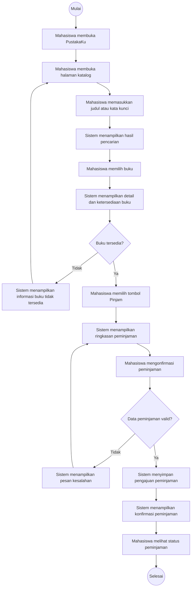

# Dokumen Kebutuhan dan User Flow — PustakaKu

## 1. Deskripsi Aplikasi

**PustakaKu** merupakan aplikasi perpustakaan kampus yang dirancang untuk membantu mahasiswa mencari buku, mengetahui ketersediaan buku, dan melakukan proses peminjaman tanpa harus datang ke perpustakaan hanya untuk mengecek informasi buku. Permasalahan yang dihadapi mahasiswa adalah keterbatasan waktu dan ketidakpraktisan ketika harus datang langsung ke perpustakaan untuk mencari atau memastikan ketersediaan buku. PustakaKu menggunakan aplikasi mobile karena mahasiswa dapat mengakses katalog dan informasi peminjaman melalui perangkat yang digunakan sehari-hari sehingga proses pencarian dan peminjaman dapat dilakukan dengan lebih praktis.

---

## 2. User Persona

### 2.1 Alya — Mahasiswa

| Komponen | Deskripsi |
|---|---|
| **Nama dan peran** | Alya — Mahasiswa |
| **Tujuan** | Mencari buku yang dibutuhkan untuk perkuliahan dan mengetahui ketersediaannya sebelum datang ke perpustakaan. |
| **Kendala** | Jadwal kuliah dan kegiatan akademik cukup padat sehingga tidak selalu dapat datang ke perpustakaan hanya untuk mengecek ketersediaan buku. |
| **Perangkat dan konteks** | Menggunakan smartphone ketika berada di kampus, di sela kegiatan perkuliahan, atau ketika membutuhkan referensi. |
| **Frekuensi penggunaan** | Beberapa kali dalam sebulan, terutama ketika mendapatkan tugas atau membutuhkan referensi perkuliahan. |

**Kebutuhan utama:**  
Alya membutuhkan fitur pencarian buku, informasi detail dan ketersediaan buku, pengajuan peminjaman, serta informasi status peminjaman.

---

### 2.2 Dimas — Petugas Perpustakaan

| Komponen | Deskripsi |
|---|---|
| **Nama dan peran** | Dimas — Petugas Perpustakaan |
| **Tujuan** | Mengelola data koleksi buku dan memastikan proses peminjaman mahasiswa tercatat dengan baik. |
| **Kendala** | Banyaknya data buku dan transaksi peminjaman membuat pencatatan dan pembaruan data secara manual membutuhkan waktu dan berpotensi menimbulkan kesalahan. |
| **Perangkat dan konteks** | Menggunakan komputer atau perangkat yang tersedia di perpustakaan selama jam operasional. |
| **Frekuensi penggunaan** | Setiap hari selama jam operasional perpustakaan. |

**Kebutuhan utama:**  
Dimas membutuhkan fitur untuk menambahkan dan memperbarui data buku serta memperbarui status peminjaman mahasiswa.

---

## 3. Kebutuhan Fungsional

Kebutuhan fungsional berikut dirumuskan menggunakan pola **aktor–aksi–objek–hasil** dan setiap kebutuhan hanya memuat satu fungsi.

| ID | Kebutuhan Fungsional | Aktor | Hasil yang Dapat Diverifikasi |
|---|---|---|---|
| **F-01** | Mahasiswa dapat mencari buku berdasarkan judul atau kata kunci. | Mahasiswa | Sistem menampilkan daftar buku yang sesuai dengan kata kunci pencarian. |
| **F-02** | Mahasiswa dapat melihat detail buku yang dipilih. | Mahasiswa | Sistem menampilkan informasi judul, penulis, dan informasi buku yang dipilih. |
| **F-03** | Mahasiswa dapat melihat status ketersediaan buku yang dipilih. | Mahasiswa | Sistem menampilkan status buku tersedia atau tidak tersedia. |
| **F-04** | Mahasiswa dapat mengajukan peminjaman buku yang tersedia. | Mahasiswa | Sistem menyimpan pengajuan peminjaman dan menampilkan status pengajuan. |
| **F-05** | Mahasiswa dapat melihat status peminjaman yang telah diajukan. | Mahasiswa | Sistem menampilkan status peminjaman sesuai kondisi terbaru. |
| **F-06** | Mahasiswa dapat melihat batas waktu pengembalian buku yang sedang dipinjam. | Mahasiswa | Sistem menampilkan tanggal batas pengembalian buku. |
| **F-07** | Petugas dapat menambahkan data buku ke katalog. | Petugas | Data buku baru tersimpan dan dapat ditemukan pada katalog. |
| **F-08** | Petugas dapat memperbarui status peminjaman mahasiswa. | Petugas | Sistem menyimpan perubahan status dan menampilkan status terbaru kepada mahasiswa. |

### Verifikasi Kebutuhan Fungsional

Setiap kebutuhan dapat diuji berdasarkan hasil yang diharapkan. Contohnya, F-01 terpenuhi apabila mahasiswa memasukkan kata kunci dan sistem menampilkan buku yang sesuai, sedangkan F-04 terpenuhi apabila pengajuan peminjaman berhasil disimpan dan status pengajuan dapat ditampilkan.

---

## 4. Kebutuhan Nonfungsional

| ID | Kategori | Kebutuhan | Kriteria Terukur |
|---|---|---|---|
| **NF-01** | Usability | Proses mahasiswa dari pencarian buku hingga pengajuan peminjaman harus memiliki alur yang sederhana. | Mahasiswa dapat mencapai tahap pengajuan peminjaman maksimal dalam **5 langkah utama** dari halaman katalog. |
| **NF-02** | Kinerja | Sistem harus memberikan respons yang cukup cepat ketika mahasiswa melakukan pencarian buku. | Hasil pencarian ditampilkan maksimal **3 detik** setelah permintaan pencarian dikirim pada kondisi jaringan yang tersedia. |
| **NF-03** | Kompatibilitas | PustakaKu harus dapat digunakan pada perangkat yang menjadi target aplikasi. | Aplikasi dapat dijalankan pada **Android dan web browser Chrome**. |
| **NF-04** | Keamanan | Data peminjaman hanya dapat diakses dan diperbarui oleh pengguna yang memiliki hak akses. | Mahasiswa hanya dapat melihat data peminjamannya sendiri, sedangkan pembaruan status peminjaman hanya dapat dilakukan oleh petugas. |

---

## 5. Prioritas Fitur — MoSCoW

Prioritas ditentukan berdasarkan tujuan utama PustakaKu, kebutuhan mahasiswa sebagai pengguna utama, dan kebutuhan petugas dalam mendukung proses peminjaman.

| ID | Fitur | Prioritas |
|---|---|---|
| F-01 | Mencari buku berdasarkan judul atau kata kunci | **Must have** |
| F-02 | Melihat detail buku | **Must have** |
| F-03 | Melihat status ketersediaan buku | **Must have** |
| F-04 | Mengajukan peminjaman buku | **Must have** |
| F-05 | Melihat status peminjaman | **Must have** |
| F-06 | Melihat batas waktu pengembalian | **Should have** |
| F-07 | Menambahkan data buku | **Should have** |
| F-08 | Memperbarui status peminjaman | **Should have** |

### Alasan Prioritas

**Must have — F-01, F-02, F-03, F-04, F-05**

Fitur tersebut menjadi prioritas utama karena langsung mendukung tujuan utama Alya sebagai mahasiswa, yaitu mencari buku, memastikan ketersediaan, melakukan peminjaman, dan mengetahui status peminjaman. Tanpa fitur tersebut, fungsi utama PustakaKu sebagai aplikasi pendukung proses peminjaman buku belum dapat berjalan.

**Should have — F-06, F-07, F-08**

Fitur tersebut penting untuk melengkapi proses penggunaan PustakaKu. F-06 membantu mahasiswa mengetahui batas pengembalian, sedangkan F-07 dan F-08 mendukung Dimas sebagai petugas dalam mengelola data buku dan proses peminjaman. Fitur ini dapat dikembangkan setelah fungsi utama mahasiswa selesai.

**Could have**

Fitur **notifikasi otomatis pengingat pengembalian buku** ditempatkan sebagai fitur tambahan. Fitur tersebut dapat membantu mahasiswa mengingat batas waktu pengembalian, tetapi proses utama pencarian dan peminjaman buku tetap dapat dilakukan tanpa fitur ini.

**Won't have**

Fitur **pembayaran denda secara online** belum menjadi bagian dari cakupan PustakaKu pada tahap ini. Fitur tersebut ditunda agar pengembangan berfokus pada proses utama pencarian, ketersediaan, peminjaman, dan pengelolaan status buku.

---

## 6. User Flow

### 6.1 Tujuan User Flow

User flow berikut menggambarkan satu tujuan utama pengguna, yaitu **mahasiswa melakukan peminjaman buku melalui PustakaKu**.

### 6.2 Diagram User Flow

### 6.3 Penjelasan User Flow

1. Mahasiswa membuka aplikasi PustakaKu.
2. Mahasiswa membuka halaman katalog.
3. Mahasiswa memasukkan judul atau kata kunci buku.
4. Sistem menampilkan hasil pencarian.
5. Mahasiswa memilih buku yang ingin dilihat.
6. Sistem menampilkan detail dan status ketersediaan buku.
7. Sistem melakukan pemeriksaan apakah buku tersedia.
8. Jika buku tidak tersedia, sistem menampilkan informasi dan mahasiswa kembali ke katalog untuk mencari buku lain.
9. Jika buku tersedia, mahasiswa memilih tombol **Pinjam**.
10. Sistem menampilkan ringkasan peminjaman.
11. Mahasiswa mengonfirmasi peminjaman.
12. Sistem memeriksa validitas data peminjaman.
13. Jika data tidak valid, sistem menampilkan pesan kesalahan dan mahasiswa kembali ke ringkasan peminjaman.
14. Jika data valid, sistem menyimpan pengajuan peminjaman.
15. Sistem menampilkan konfirmasi peminjaman.
16. Mahasiswa melihat status peminjaman.
17. Proses selesai.

User flow memiliki dua titik keputusan:

- **Buku tersedia?**
  - Ya → melanjutkan proses peminjaman.
  - Tidak → menampilkan informasi dan kembali ke katalog.
- **Data peminjaman valid?**
  - Ya → menyimpan pengajuan.
  - Tidak → menampilkan pesan kesalahan dan kembali ke ringkasan.

---

## 7. Pemetaan Kebutuhan ke Antarmuka

| ID | Kebutuhan | Prioritas | Halaman yang Memenuhi | Widget yang Direncanakan |
|---|---|---|---|---|
| F-01 | Mencari buku berdasarkan judul atau kata kunci | Must | Katalog | `Scaffold`, `Column`, `TextField`, `ListView` |
| F-02 | Melihat detail buku | Must | Detail Buku | `Scaffold`, `Column`, `Text`, `ElevatedButton` |
| F-03 | Melihat status ketersediaan buku | Must | Detail Buku | `Column`, `Text`, `Container` |
| F-04 | Mengajukan peminjaman buku | Must | Peminjaman | `Scaffold`, `Column`, `Text`, `ElevatedButton` |
| F-05 | Melihat status peminjaman | Must | Status Peminjaman | `Scaffold`, `ListView`, `ListTile` |
| F-06 | Melihat batas waktu pengembalian | Should | Status Peminjaman | `ListView`, `ListTile`, `Text` |
| F-07 | Menambahkan data buku | Should | Kelola Buku | `Scaffold`, `Column`, `TextField`, `ElevatedButton` |
| F-08 | Memperbarui status peminjaman | Should | Kelola Peminjaman | `ListView`, `ListTile`, `DropdownButton` |

Widget yang tercantum merupakan rancangan awal berdasarkan materi Pertemuan 3 dan masih dapat diperhalus pada tahap perancangan UI/UX.

---

## 8. Verifikasi Hasil Analisis

| No. | Pemeriksaan | Hasil |
|---|---|---|
| 1 | Deskripsi memuat nama aplikasi, masalah pengguna, dan alasan solusi mobile | ✅ |
| 2 | Terdapat minimal 2 persona dengan 2 peran berbeda | ✅ |
| 3 | Setiap persona memiliki lima komponen yang dipersyaratkan | ✅ |
| 4 | Terdapat minimal 6 kebutuhan fungsional | ✅ |
| 5 | Setiap kebutuhan fungsional menggunakan pola aktor–aksi–hasil | ✅ |
| 6 | Setiap kebutuhan fungsional dapat diverifikasi | ✅ |
| 7 | Terdapat minimal 2 kebutuhan nonfungsional terukur | ✅ |
| 8 | Seluruh kebutuhan fungsional memiliki prioritas MoSCoW | ✅ |
| 9 | Jumlah Must have tidak lebih dari 5 | ✅ |
| 10 | Setiap kategori MoSCoW memiliki alasan | ✅ |
| 11 | User flow memiliki minimal 8 langkah | ✅ |
| 12 | User flow memiliki minimal 2 titik keputusan | ✅ |
| 13 | Setiap keputusan memiliki cabang gagal | ✅ |
| 14 | Setiap kebutuhan fungsional dipetakan ke halaman dan widget | ✅ |

---

## 9. Refleksi

Bagian yang paling sulit ditetapkan adalah **prioritas fitur**, karena beberapa kebutuhan mahasiswa dan petugas sama-sama penting tetapi harus disesuaikan dengan fokus utama aplikasi PustakaKu. Penentuan Must, Should, Could, dan Won't membutuhkan pertimbangan terhadap tujuan utama mahasiswa dalam mencari dan meminjam buku serta kebutuhan petugas dalam mendukung proses tersebut. Penyusunan prioritas ini membantu menentukan fitur yang harus dikembangkan terlebih dahulu agar PustakaKu tetap memiliki fungsi utama yang jelas.

---

## 10. Deklarasi Penggunaan AI

**Deklarasi penggunaan AI:** ChatGPT — membantu meninjau rumusan kebutuhan fungsional dan nonfungsional, menyusun prioritas MoSCoW, serta memeriksa struktur user flow; hasilnya dirumuskan ulang oleh penulis.