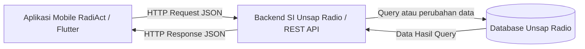

# Tugas 1: Identifikasi Kebutuhan Aplikasi Bergerak

**Nama** : Deyna Angeliawati Zahara  
**NPM** : 230660221032  
**Kelas** : SI VII B  


## 1. Domain yang Dipilih
Manajemen Program Kerja Harian (Media/Konten) UKM Unsap Radio - RADIACT


## 2. Deskripsi Sistem

Aplikasi **RadiAct (Radio Activity)** dirancang untuk digunakan oleh seluruh anggota UKM Unsap Radio sebagai pengguna dengan hak akses pemantauan (view-only), serta Ketua Divisi dan Badan Pengurus Harian sebagai pengelola yang memiliki wewenang untuk memperbarui data serta status operasional konten. Permasalahan utama yang dihadapi saat ini adalah jadwal publikasi konten yang terpusat di grup whatsaap atau penyimpanan awan sering kali tertimbun, ketiadaan sistem notifikasi otomatis yang mengakibatkan tingginya tingkat kelalaian tenggat waktu, alur koordinasi konfirmasi publikasi yang bersifat personal tanpa transparansi kepada pengurus, serta tingginya intensitas revisi jadwal harian yang memicu keterlambatan dan ketidakpastian eksekusi program kerja. Solusi berbasis aplikasi mobile diimplementasikan untuk mengakomodasi konteks bergerak, di mana seluruh anggota dapat memantau keterbukaan informasi jadwal secara praktis dari handphone, serta mendukung sesi penggunaan singkat melalui antarmuka yang efisien agar pengelola dapat memperbarui status kesiapan konten secara cepat di sela-sela aktivitas akademik.


## 3. Diagram Arsitektur
Berikut adalah Rancangan Diagram Arsitektur Aplikasi RadiAct (Radio Activity):





## 4. Tabel Kebutuhan

| No. | Permintaan | Pengguna | Karakteristik Mobile yang Terkait | Fitur Aplikasi | Materi Pemenuh |
| :---: | :--- | :--- | :--- | :--- | :---: |
| **1** | Melihat jadwal publikasi konten dan siaran harian UKM Unsap Radio | Seluruh Anggota | **Sesi penggunaan singkat:** jadwal harian dapat diperiksa dengan cepat melalui layar HP. | Halaman jadwal harian Publikasi Konten | Minggu 5–6 |
| **2** | Mengunggah file atau draf konten yang akan di-upload | Ketua Divisi Umum | **Konteks bergerak:** pengiriman berkas atau draf konten dapat dilakukan langsung dari HP. | Form upload file/dokumen (draf konten) | Minggu 7 dan 11 |
| **3** | Mengunduh atau membuka bahan konten untuk dicek sebelum dipublikasikan | Ketua Divisi Media dan BPH | **Konteks bergerak:** bahan konten dapat diakses dan diunduh di mana saja sebelum di-upload ke media sosial. | Fitur download / buka file (konten) | Minggu 7 dan 11 |
| **4** | Memperbarui status kesiapan konten (misal: dari Draft, Siap Upload, Selesai) | Ketua Divisi Umum | **Interaksi sentuh:** pengubahan status dilakukan melalui pilihan sederhana tanpa mengetik panjang. | Tombol / pilihan ubah status konten | Minggu 5–6 |
| **5** | Mengedit dan merevisi tanggal atau jam jadwal publikasi yang bentrok | BPH | **Interaksi sentuh dan sesi penggunaan singkat:** perubahan jadwal dapat dilakukan dengan cepat saat ada revisi. | Form edit/revisi jadwal | Minggu 5–6 |
| **6** | Menerima pengingat sebelum jadwal siaran atau deadline upload konten | Ketua Divisi Umum dan Media | **Sesi penggunaan singkat:** pengguna mendapat pemberitahuan langsung di layar tanpa harus membuka aplikasi. | Notifikasi lokal terjadwal | Minggu 11 |
| **7** | Mengelola data utama anggota dan penyimpanan data pusat | Admin / Petugas | **Tidak berlaku:** karena pengolahan data utama dilakukan pada sistem pusat. | Di luar lingkup (backend SI) — pengelolaan data dan penyimpanan pusat | Di luar PAB (Backend SI) |

## 5. Bukti Environment Siap

| Bukti | File |
| :--- | :--- |
| `flutter doctor -v` sebelum perbaikan | `flutter-doctor/sebelum.png` |
| `flutter doctor -v` sesudah perbaikan | `flutter-doctor/sesudah.png` |
| Aplikasi counter berjalan pada target web, emulator, atau perangkat fisik | `aplikasi.png` |


## 6. Refleksi

Pengelolaan alur kerja dan materi operasional menjadikan fitur **file** sebagai kebutuhan utama dalam domain ini. Keberadaan fitur notifikasi memang penting untuk mengingatkan tenggat waktu, namun akses berkas secara langsung jauh lebih berdampak dalam mengatasi masalah materi dan jadwal yang sering tertimbun. Integrasi fitur file pada perangkat seluler memudahkan pengelola mengunggah serta membagikan dokumen operasional Unsap Radio secara terpusat dan transparan.


## 7. Struktur Folder

```text
tugas1_Deyna/
├── README.md
├── diagram.png
├── diagram.mmd
├── flutter-doctor/
│   ├── sebelum.png
│   └── sesudah.png
└── aplikasi.png
```