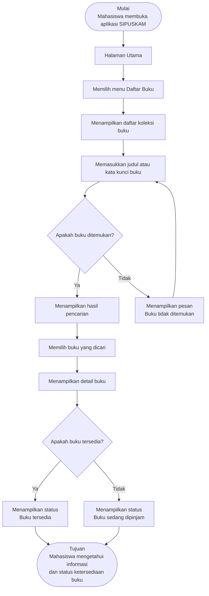

# Dokumen Kebutuhan — SIPUSKAM

## 1. Deskripsi Aplikasi

SIPUSKAM merupakan aplikasi mobile sistem informasi perpustakaan kampus yang membantu mahasiswa memperoleh informasi mengenai koleksi buku dan membantu petugas perpustakaan dalam mengelola data buku. Pengguna membutuhkan cara yang lebih praktis untuk mengetahui daftar, informasi, dan status ketersediaan buku tanpa harus mencari informasi secara langsung kepada petugas. Solusi berbentuk aplikasi mobile dipilih karena mahasiswa dan petugas dapat mengakses informasi serta melakukan pengelolaan data melalui perangkat yang digunakan dalam aktivitas perpustakaan.

## 2. User Persona

### Persona 1 — Rani — Mahasiswa

| Komponen              | Isi                                                                                                                                   |
| --------------------- | ------------------------------------------------------------------------------------------------------------------------------------- |
| Nama dan peran        | Rani — Mahasiswa                                                                                                                      |
| Tujuan                | Menemukan informasi buku yang tersedia di perpustakaan sebelum mencari buku secara langsung.                                          |
| Kendala               | Tidak selalu mengetahui buku apa saja yang tersedia dan perlu memastikan status ketersediaan buku sebelum mencarinya di perpustakaan. |
| Perangkat dan konteks | Menggunakan ponsel ketika berada di kampus, di kelas, atau sebelum datang ke perpustakaan untuk mencari informasi buku.               |
| Frekuensi penggunaan  | Beberapa kali dalam satu minggu, terutama ketika membutuhkan referensi atau mencari buku tertentu.                                    |

### Persona 2 — Dimas — Petugas Perpustakaan

| Komponen              | Isi                                                                                                                     |
| --------------------- | ----------------------------------------------------------------------------------------------------------------------- |
| Nama dan peran        | Dimas — Petugas Perpustakaan                                                                                            |
| Tujuan                | Mengelola dan memperbarui informasi koleksi buku agar data katalog dan status ketersediaan dapat diketahui pengguna.    |
| Kendala               | Data buku perlu diperbarui ketika terdapat penambahan koleksi atau perubahan informasi maupun status ketersediaan buku. |
| Perangkat dan konteks | Menggunakan ponsel ketika melakukan pengelolaan data buku di lingkungan perpustakaan kampus.                            |
| Frekuensi penggunaan  | Digunakan secara rutin selama kegiatan pengelolaan perpustakaan, terutama ketika terdapat perubahan data koleksi.       |

## 3. Kebutuhan Fungsional

| ID   | Rumusan Kebutuhan                                                                                                | Terkait Persona |
| ---- | ---------------------------------------------------------------------------------------------------------------- | --------------- |
| F-01 | Mahasiswa dapat melihat daftar buku yang tersedia di perpustakaan untuk mengetahui koleksi yang dapat digunakan. | Persona 1       |
| F-02 | Mahasiswa dapat melihat detail informasi buku untuk mengetahui informasi buku yang dipilih.                      | Persona 1       |
| F-03 | Mahasiswa dapat mencari buku berdasarkan judul atau kata kunci untuk menemukan buku yang dibutuhkan.             | Persona 1       |
| F-04 | Petugas perpustakaan dapat menambahkan data buku ke dalam sistem untuk mencatat koleksi baru.                    | Persona 2       |
| F-05 | Petugas perpustakaan dapat mengubah informasi buku untuk memperbarui data koleksi yang tersimpan.                | Persona 2       |
| F-06 | Petugas perpustakaan dapat mengubah status ketersediaan buku untuk menunjukkan kondisi buku kepada mahasiswa.    | Persona 2       |

## 4. Kebutuhan Nonfungsional

| ID    | Kategori | Rumusan                                                                                                       | Kriteria Terukur                                                                        |
| ----- | -------- | ------------------------------------------------------------------------------------------------------------- | --------------------------------------------------------------------------------------- |
| NF-01 | Kegunaan | Aplikasi harus memungkinkan mahasiswa menemukan informasi buku yang dibutuhkan dengan langkah yang sederhana. | Informasi buku dapat ditemukan dalam maksimal 5 langkah dari halaman utama.             |
| NF-02 | Kinerja  | Aplikasi harus menampilkan daftar koleksi buku setelah pengguna membuka halaman daftar buku.                  | Daftar buku ditampilkan dalam waktu maksimal 3 detik pada koneksi internet yang stabil. |

## 5. Prioritas Fitur (MoSCoW)

| Prioritas             | ID Kebutuhan           | Alasan                                                                                                                                                                                                                      |
| --------------------- | ---------------------- | --------------------------------------------------------------------------------------------------------------------------------------------------------------------------------------------------------------------------- |
| Must have             | F-01, F-02, F-03, F-04 | Fitur tersebut merupakan fungsi utama SIPUSKAM. Mahasiswa membutuhkan akses terhadap informasi dan pencarian buku, sedangkan petugas membutuhkan kemampuan menambahkan koleksi agar data perpustakaan dapat dikelola.       |
| Should have           | F-05, F-06             | Pengubahan informasi dan status ketersediaan buku diperlukan untuk menjaga data koleksi tetap sesuai dengan kondisi terbaru, tetapi fungsi dasar aplikasi masih dapat berjalan tanpa kedua fungsi tersebut pada tahap awal. |
| Could have            | —                      | Belum terdapat kebutuhan fungsional tambahan yang diprioritaskan sebagai fitur pelengkap pada ruang lingkup tahap ini.                                                                                                      |
| Won't have (saat ini) | —                      | Belum terdapat kebutuhan fungsional yang perlu ditunda secara khusus pada tahap ini.                                                                                                                                        |

## 6. User Flow

### 6.1 Identitas Alur

| Aspek       | Isi                                                                                                |
| ----------- | -------------------------------------------------------------------------------------------------- |
| Nama alur   | Mencari informasi buku                                                                             |
| Aktor       | Rani — Mahasiswa                                                                                   |
| Tujuan alur | Mahasiswa berhasil menemukan informasi buku yang dibutuhkan dan mengetahui status ketersediaannya. |

### 6.2 Diagram User Flow

Diagram menggambarkan satu tujuan pengguna, yaitu mahasiswa mencari informasi buku sampai mengetahui status ketersediaannya.

File hasil ekspor diagram disimpan sebagai **`user-flow.png`** pada folder tugas.

### 6.3 Daftar Langkah

| No. | Jenis     | Langkah/Halaman                                             | Bila gagal                                                                                   |
| --: | --------- | ----------------------------------------------------------- | -------------------------------------------------------------------------------------------- |
|   1 | Mulai     | Mahasiswa membuka aplikasi SIPUSKAM                         | —                                                                                            |
|   2 | Halaman   | Sistem menampilkan halaman utama                            | —                                                                                            |
|   3 | Halaman   | Mahasiswa memilih menu Daftar Buku                          | —                                                                                            |
|   4 | Halaman   | Sistem menampilkan daftar koleksi buku                      | —                                                                                            |
|   5 | Halaman   | Mahasiswa memasukkan judul atau kata kunci buku             | —                                                                                            |
|   6 | Keputusan | Apakah buku ditemukan?                                      | Jika tidak, sistem menampilkan pesan buku tidak ditemukan dan pengguna kembali ke pencarian. |
|   7 | Halaman   | Sistem menampilkan hasil pencarian buku                     | —                                                                                            |
|   8 | Halaman   | Mahasiswa memilih buku yang dicari                          | —                                                                                            |
|   9 | Halaman   | Sistem menampilkan detail buku                              | —                                                                                            |
|  10 | Keputusan | Apakah buku tersedia?                                       | Jika tidak, sistem menampilkan status buku sedang dipinjam.                                  |
|  11 | Halaman   | Sistem menampilkan informasi bahwa buku tersedia            | —                                                                                            |
|  12 | Tujuan    | Mahasiswa mengetahui informasi dan status ketersediaan buku | —                                                                                            |

### 6.4 Daftar Pemeriksaan Diagram

* [x] Jumlah langkah minimal 8 di luar titik mulai dan tujuan.
* [x] Jumlah titik keputusan minimal 2.
* [x] Setiap keputusan memiliki cabang Ya dan Tidak yang ditindaklanjuti.
* [x] Tidak ada langkah yang buntu.
* [x] Label setiap langkah dapat dipahami tanpa penjelasan lisan.
* [ ] Diagram telah diuji dengan cara ditelusuri oleh satu teman sekelas (peer review).

## 7. Pemetaan Kebutuhan ke Antarmuka

| ID Kebutuhan | Rumusan (ringkas)                         | Prioritas | Halaman yang Memenuhi | Widget yang Direncanakan (P3)                   |
| ------------ | ----------------------------------------- | --------- | --------------------- | ----------------------------------------------- |
| F-01         | Mahasiswa melihat daftar buku             | Must      | Halaman Daftar Buku   | Scaffold + AppBar + ListView.builder + ListTile |
| F-02         | Mahasiswa melihat detail buku             | Must      | Halaman Detail Buku   | Scaffold + AppBar + Column + Card               |
| F-03         | Mahasiswa mencari buku                    | Must      | Halaman Daftar Buku   | Scaffold + AppBar + Column + ListView.builder   |
| F-04         | Petugas menambahkan data buku             | Must      | Halaman Tambah Buku   | Scaffold + AppBar + Column + Row                |
| F-05         | Petugas mengubah informasi buku           | Should    | Halaman Edit Buku     | Scaffold + AppBar + Column + Row                |
| F-06         | Petugas mengubah status ketersediaan buku | Should    | Halaman Edit Buku     | Scaffold + AppBar + Column + Row                |

## Daftar Pemeriksaan Sebelum Mengumpulkan

* [x] Seluruh teks petunjuk `[ ... ]` telah diganti.
* [x] Setiap persona memuat kelima komponen.
* [x] Setiap kebutuhan fungsional mengikuti pola aktor–aksi–hasil dan satu fungsi per pernyataan.
* [x] Kebutuhan nonfungsional memiliki kriteria terukur.
* [x] Seluruh kebutuhan fungsional berprioritas.
* [x] Must have ≤ 5.
* [x] Setiap kebutuhan fungsional muncul pada tabel pemetaan.
* [ ] User flow telah diuji melalui peer review.
