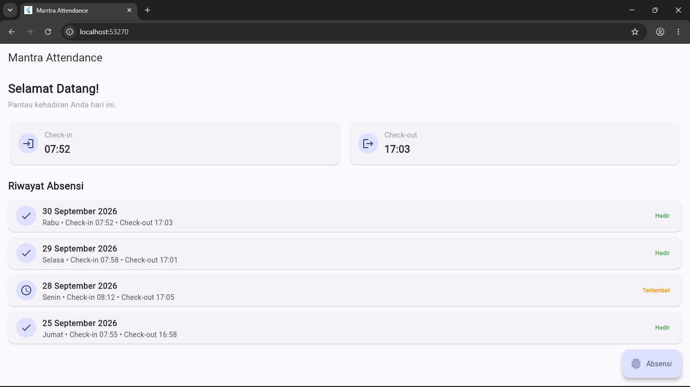

# Tugas 3 — Halaman Aplikasi Sederhana

**Nama:** [ Jajang Komara ]  
**NIM:** [ 230660221102 ]  

## 1. Nama Aplikasi

**Mantra Attendance**

## 2. Domain Sistem Informasi

Sistem Absensi Karyawan PT Mantra Group

## 3. Deskripsi Halaman

Mantra Attendance merupakan halaman dashboard sederhana untuk aplikasi absensi karyawan PT Mantra Group yang bergerak di bidang real estate dan perumahan. Halaman ini menampilkan sapaan kepada pengguna, informasi waktu check-in dan check-out, serta riwayat kehadiran karyawan dalam bentuk daftar. Data yang digunakan pada tugas ini masih berupa data statis di dalam kode dan belum menggunakan database atau API. Halaman dirancang menggunakan beberapa widget dan layout Flutter seperti MaterialApp, Scaffold, AppBar, Column, Row, Padding, dan ListView.builder.

## 4. Data yang Ditampilkan

Halaman menggunakan empat data riwayat absensi:

| Tanggal | Hari | Check-in | Check-out | Status |
|---|---|---|---|---|
| 30 September 2026 | Rabu | 07:52 | 17:03 | Hadir |
| 29 September 2026 | Selasa | 07:58 | 17:01 | Hadir |
| 28 September 2026 | Senin | 08:12 | 17:05 | Terlambat |
| 25 September 2026 | Jumat | 07:55 | 16:58 | Hadir |

## 5. Widget dan Layout

Widget dan layout yang digunakan dalam halaman ini meliputi:

- `MaterialApp`
- `Scaffold`
- `AppBar`
- `Column`
- `Row`
- `Padding`
- `ListView.builder`
- `Card`
- `ListTile`
- `CircleAvatar`
- `FloatingActionButton.extended`
- `Text`
- `Icon`

Layout utama halaman menggunakan `Column` untuk menyusun konten secara vertikal, `Row` untuk menampilkan informasi check-in dan check-out secara horizontal, `Padding` untuk memberikan jarak pada konten, dan `ListView.builder` untuk menampilkan daftar riwayat absensi.

## 6. Widget Tree

Widget tree halaman dibuat menggunakan Mermaid dan menunjukkan hubungan antara `MaterialApp`, `Scaffold`, `AppBar`, `body`, serta widget-widget yang digunakan pada halaman.

File sumber:

`widget-tree.mmd`

Hasil ekspor:

`widget-tree.png`

## 7. Screenshot Halaman

Hasil halaman aplikasi setelah dijalankan pada browser Chrome:

## 8. Refleksi

Widget layout yang paling sulit saya rangkai adalah `ListView.builder` di dalam `Column` karena membutuhkan pengaturan ruang agar daftar dapat digulir tanpa menyebabkan `RenderFlex overflow`. Saya menggunakan `Expanded` sebagai pembungkus `ListView.builder` sehingga daftar riwayat dapat menggunakan ruang yang tersedia pada halaman. Dari proses tersebut saya memahami bahwa struktur parent-child pada layout Flutter sangat memengaruhi bagaimana ukuran dan ruang setiap widget ditentukan.